# Лабораторная работа №3: Веб-приложение по палеонтологии

## Описание проекта

Данное веб-приложение представляет собой многостраничный сайт, посвященный палеонтологии и доисторическим животным. Проект разработан в рамках лабораторной работы №3 по программированию сетевых приложений.

### Основные возможности:
- Просмотр списка доисторических животных на главной странице (24 вида)
- Детальная информация о каждом животном с галереей фотографий
- Интерактивная 3D модель динозавра на главной странице
- Полноэкранный просмотр фотографий с навигацией по стрелкам
- Лабораторный блок с реализацией 11 функций для работы с коллекциями
- Адаптивный дизайн для всех устройств
- Тёмная и светлая тема с сохранением в localStorage

## Содержание проекта

### Главная страница
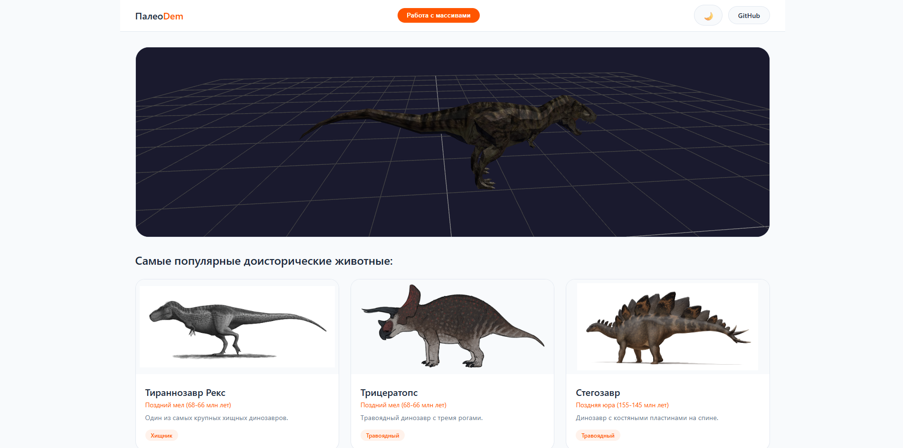
Страница "Главное", открывается при запуске приложения
- **3D просмотрщик** — интерактивная модель динозавра (вращение мышью, авто-вращение)
- **Сетка карточек** — 24 доисторических существа с фотографиями и краткой информацией
- **Переход на страницу функций** — кнопка "Работа с массивами"

  #### Реализация переключения темы
Файл: `pages/main/index.js`

```javascript
initTheme() {
    const savedTheme = localStorage.getItem('paleoTheme');
    if (savedTheme === 'dark') {
        document.body.classList.add('dark-theme');
    }
}

// Кнопка переключения
themeToggle.addEventListener('click', () => {
    document.body.classList.toggle('dark-theme');
    const isDark = document.body.classList.contains('dark-theme');
    localStorage.setItem('paleoTheme', isDark ? 'dark' : 'light');
});
```

### Страница динозавра
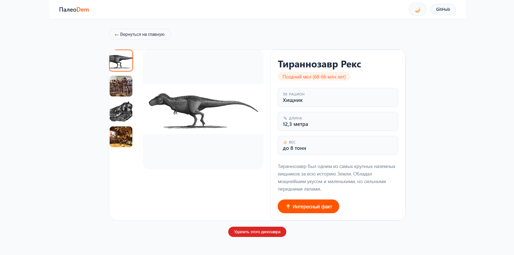
- **Галерея изображений** — вертикальный столбец миниатюр слева, основное фото справа
- **Полноэкранный режим** — клик на фото или кнопку ⛶, навигация стрелками клавиатуры
- **Интересные факты** — модальное окно с уникальной информацией
#### Реализация карточек динозавров
Файл: `components/dinosaur-card/index.js`

```javascript
export class DinosaurCardComponent {
    getHTML(data) {
        const imageUrl = data.images && data.images.length > 0 ? data.images[0] : 'https://via.placeholder.com/300x200?text=No+Image';
        return `
            <div class="dino-card" id="dino-card-${data.id}">
                
                <div class="dino-card-content">
                    <h3 class="dino-card-title">${data.title}</h3>
                    <div class="dino-card-period">${data.period}</div>
                    <p class="dino-card-description">${data.short_description}</p>
                    <span class="dino-card-diet">${data.diet}</span>
                </div>
            </div>
        `;
    }
}
```

### Страница функций (Работа с коллекциями)
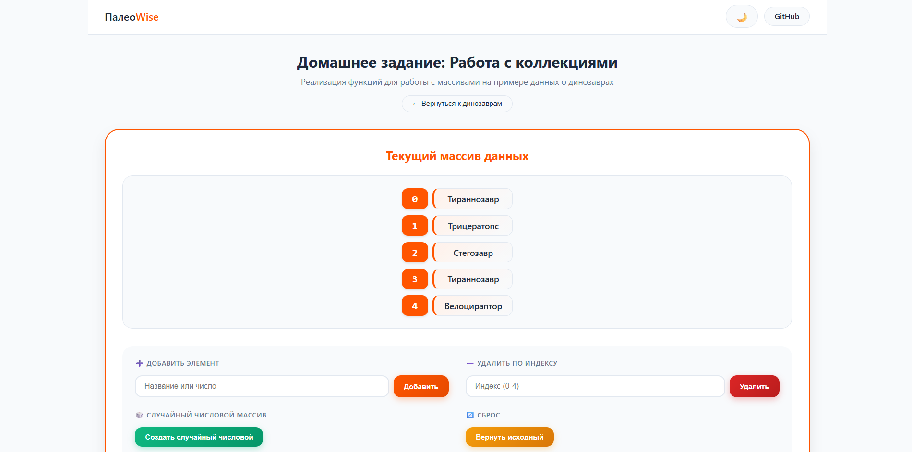
Реализованы все задания из методички:

| № | Функция | Описание | Интерактивность |
|---|---------|----------|-----------------|
| 1.1 | concatenate | Склеивает массив с разделителем | Выбор разделителя |
| 1.2 | countIdentic | Количество повторяющихся элементов | Работает с текущим массивом |
| 1.3 | sumOfSquares | Сумма квадратов чисел | Работает с числовым массивом |
| 1.4 | sumAndMult | Сумма и произведение чисел | Работает с числовым массивом |
| 1.5 | moveElement | Перемещает элемент из from в to | Пользователь вводит индексы |
| 1.6 | isEqualArrays | Сравнивает два массива | Редактируемый второй массив |
| 1.7 | isEqualObj | Сравнивает два JSON объекта | Редактируемые JSON поля |
| 1.8 | average | Среднее арифметическое чисел | Работает с числовым массивом |
| 1.9 | fill | Создаёт массив с одинаковыми значениями | Выбор размера и значения |
| 1.10 | erase | Очищает от ложных значений | Редактируемый тестовый массив |
| 2.4 | diff | Разница двух массивов | Редактируемый второй массив |

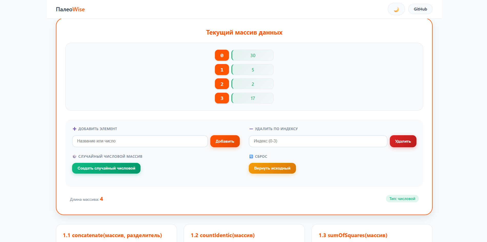
#### Управление массивом на странице функций:
- **Добавить элемент** — ввод текста или числа
- **Удалить по индексу** — удаление любого элемента
- **Случайный числовой массив** — генерация 3-7 чисел от 1 до 50
- **Сброс к исходному** — восстановление массива динозавров

#### Реализация функций
Файл: `pages/functions/index.js`

```javascript
// 1.1 concatenate
concatenate(arr, separator) {
    return arr.join(separator);
}

// 1.2 countIdentic
countIdentic(arr) {
    const counts = {};
    arr.forEach(item => { counts[item] = (counts[item] || 0) + 1; });
    let duplicates = 0;
    for (let key in counts) if (counts[key] > 1) duplicates++;
    return duplicates;
}

// 1.3 sumOfSquares
sumOfSquares(arr) {
    const numbers = arr.filter(item => !isNaN(parseFloat(item)) && isFinite(item)).map(Number);
    return numbers.reduce((sum, num) => sum + num * num, 0);
}

// 1.4 getSumAndMultOfArray
getSumAndMultOfArray(arr) {
    const numbers = arr.filter(item => !isNaN(parseFloat(item)) && isFinite(item)).map(Number);
    const sum = numbers.reduce((s, n) => s + n, 0);
    const mult = numbers.reduce((m, n) => m * n, 1);
    return { sum, mult };
}

// 1.5 moveElement
moveElement(arr, from, to) {
    const result = [...arr];
    const element = result[from];
    result.splice(from, 1);
    result.splice(to, 0, element);
    return result;
}

// 1.9 fill
fill(arraySize, data) {
    return new Array(arraySize).fill(data);
}

// 1.10 erase
erase(arr) {
    return arr.filter(item => 
        item !== false && item !== undefined && 
        item !== null && item !== 0 && item !== ''
    );
}

// 2.4 diff
diff(arr1, arr2) {
    return arr1.filter(item => !arr2.includes(item));
}
```

## Технологии

- **HTML** — семантическая структура страниц
- **CSS** — современные стили, CSS переменные, анимации, адаптивность
- **JavaScript** — модульная архитектура, классы, промисы
- **Three.js** — 3D моделирование и рендеринг
- **GLTFLoader** — загрузка .glb моделей
- **LocalStorage** — сохранение темы

##  Запуск проекта

### Способ 1: Через Live Server (рекомендуется)

1. Установите расширение **Live Server** в VS Code
2. Нажмите правой кнопкой мыши на `index.html`
3. Выберите **"Open with Live Server"**

### Способ 2: Без установки Node.js

Проект использует Bootstrap CDN, поэтому не требует установки зависимостей. Просто откройте `index.html` в браузере (но для работы 3D модели нужен Live Server).

## Управление

### 3D модель на главной странице
- **Вращение** — зажать левую кнопку мыши и двигать
- **Приближение/отдаление** — колесико мыши
- **Автовращение** — включено по умолчанию

#### Реализация 3D-просмотрщика
Файл: `components/3d-viewer/index.js`

```javascript
import * as THREE from 'three';
import { OrbitControls } from 'three/addons/controls/OrbitControls.js';
import { GLTFLoader } from 'three/addons/loaders/GLTFLoader.js';

export class ThreeDViewer {
    init() {
        this.scene = new THREE.Scene();
        this.camera = new THREE.PerspectiveCamera(45, width / height, 0.1, 1000);
        this.renderer = new THREE.WebGLRenderer({ antialias: true });
        
        this.controls = new OrbitControls(this.camera, this.renderer.domElement);
        this.controls.autoRotate = true;
        this.controls.autoRotateSpeed = 1.5;
        
        this.addLights();
        this.loadModel();
        this.animate();
    }
}
```

### Галерея на странице динозавра
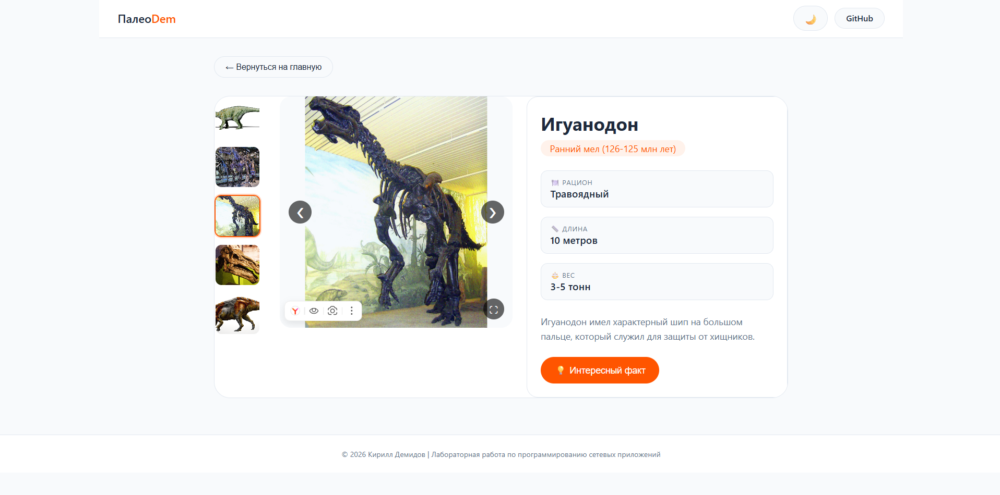
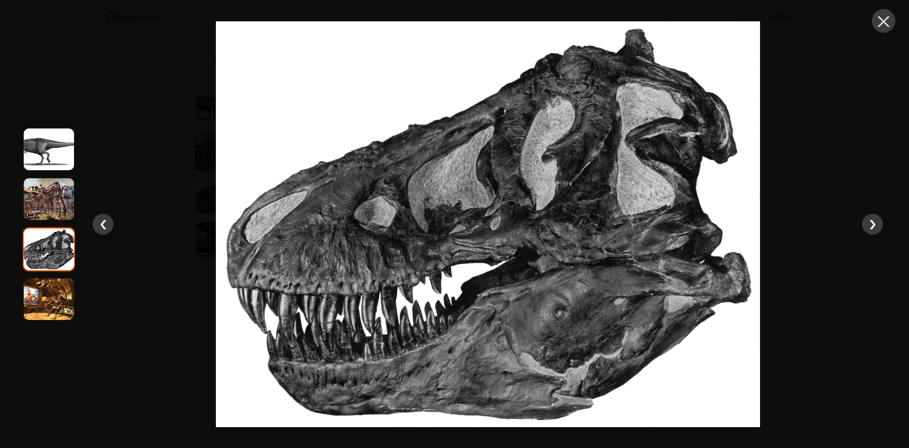
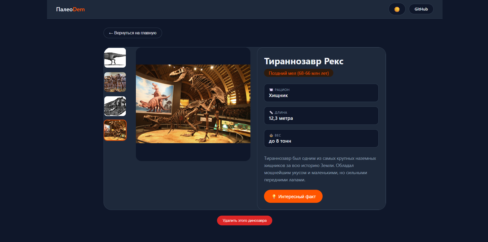
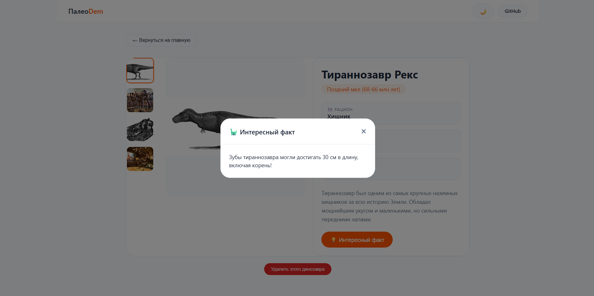
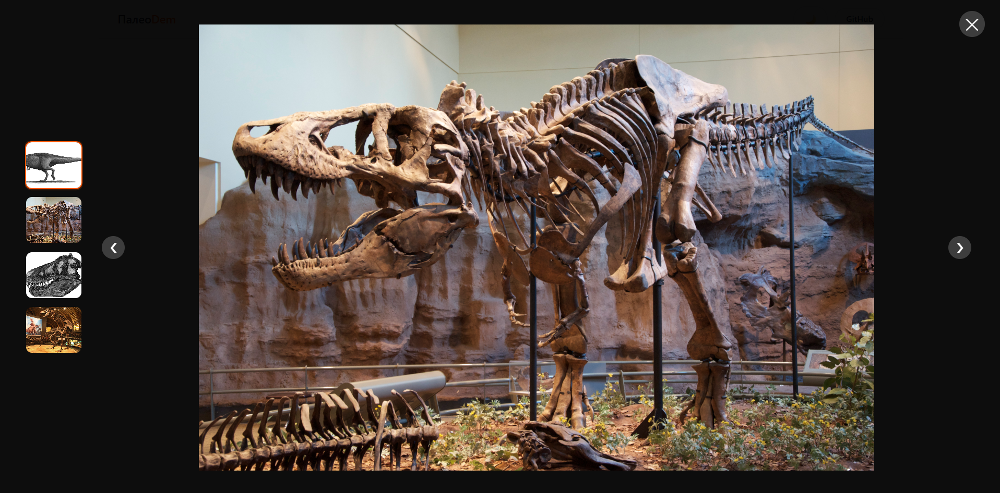
- **Переключение фото** — клик по миниатюре слева
- **Стрелки навигации** — появляются при наведении на фото
- **Полноэкранный режим** — клик на фото или кнопку ⛶
- **Клавиши в полноэкранном режиме** — ← → для переключения, ESC для выхода

#### Реализация галереи
Файл: `components/dinosaur-info/index.js`

```javascript
export class DinosaurInfoComponent {
    getHTML(data) {
        return `
            <div class="thumbnail-column-wrapper">
                <div class="thumbnail-column" id="thumbnailColumn">
                    ${this.getThumbnailsHTML(data.images)}
                </div>
            </div>
            <div class="main-image-container">
                <div class="main-image-wrapper">
                    
                    <button class="gallery-nav prev" id="prevImageBtn">❮</button>
                    <button class="gallery-nav next" id="nextImageBtn">❯</button>
                    <button class="fullscreen-btn" id="fullscreenBtn">⛶</button>
                </div>
            </div>
        `;
    }
    
    openFullscreen() {
        // Полноэкранный режим с навигацией по стрелкам
        document.addEventListener('keydown', (e) => {
            if (e.key === 'ArrowLeft') this.prevImage();
            if (e.key === 'ArrowRight') this.nextImage();
            if (e.key === 'Escape') this.closeFullscreen();
        });
    }
}
```

### Страница функций
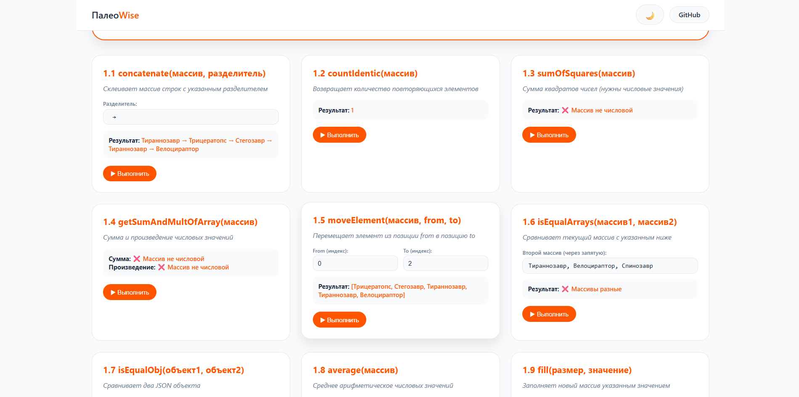
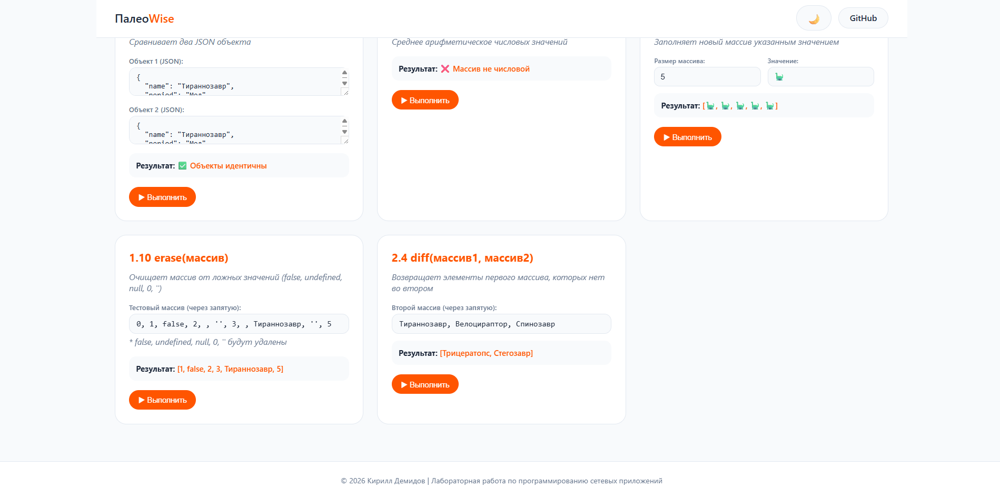
- **Редактирование массива** — добавляйте и удаляйте элементы
- **Генерация чисел** — кнопка "Создать случайный числовой"
- **Настройка параметров** — для каждой функции свои интерактивные поля

## Автор

**Демидов Кирилл Андреевич**  
Студент ИУ5-43б  
Курс: Программирование сетевых приложений

## Дата

11.04.2026

## Примечание

Проект выполнен в рамках учебной программы. Все изображения и данные о доисторических животных взяты из открытых источников (Википедия) и используются в образовательных целях. 3D модель динозавра создана из геометрических примитивов (fallback) или загружается из папки `models/dinosaur.glb`.
