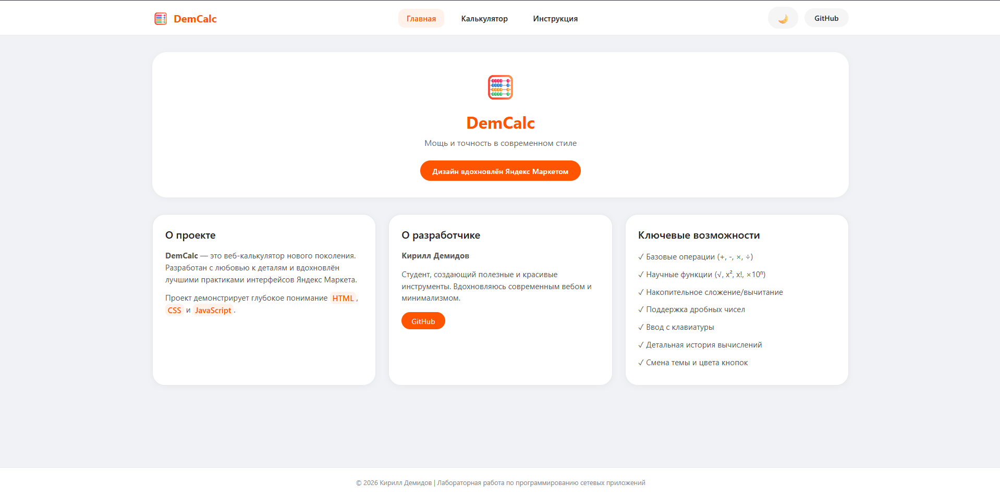
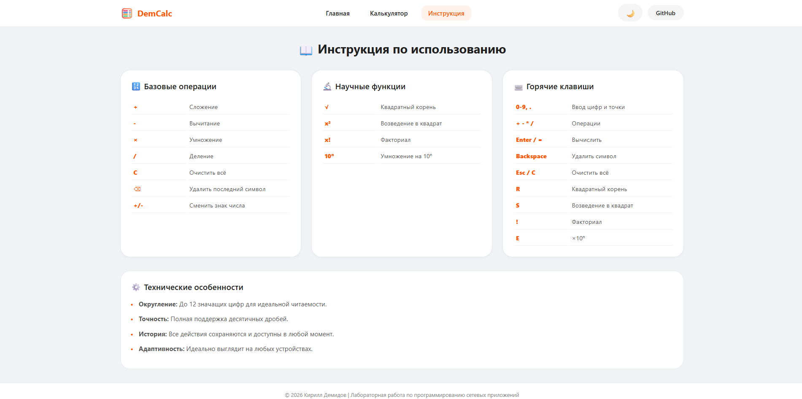
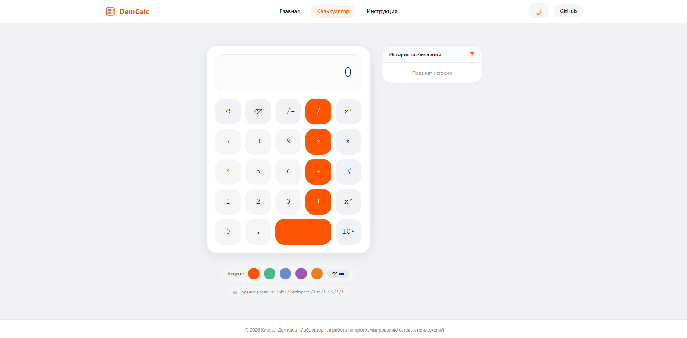
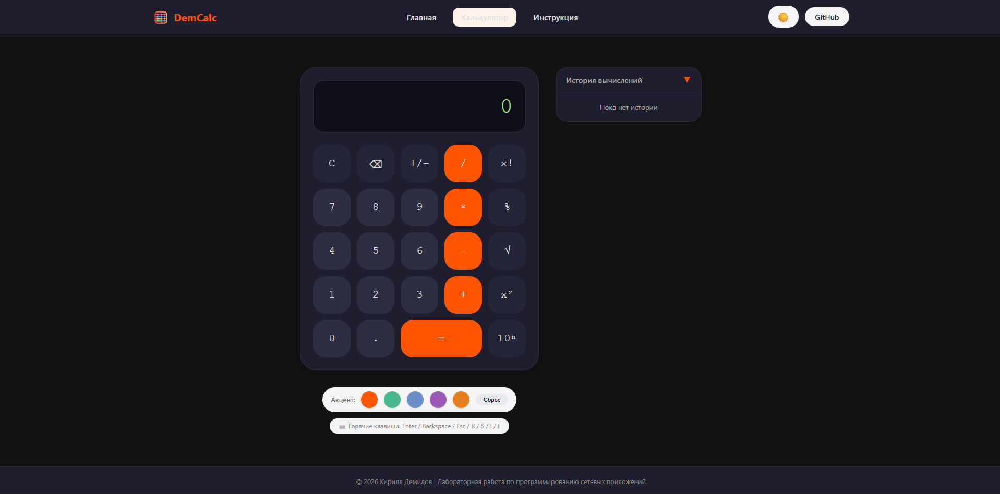
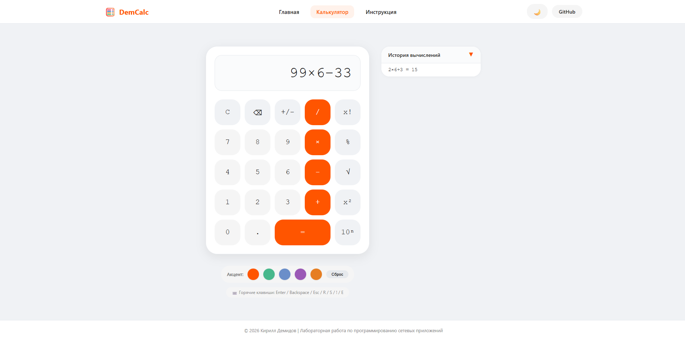
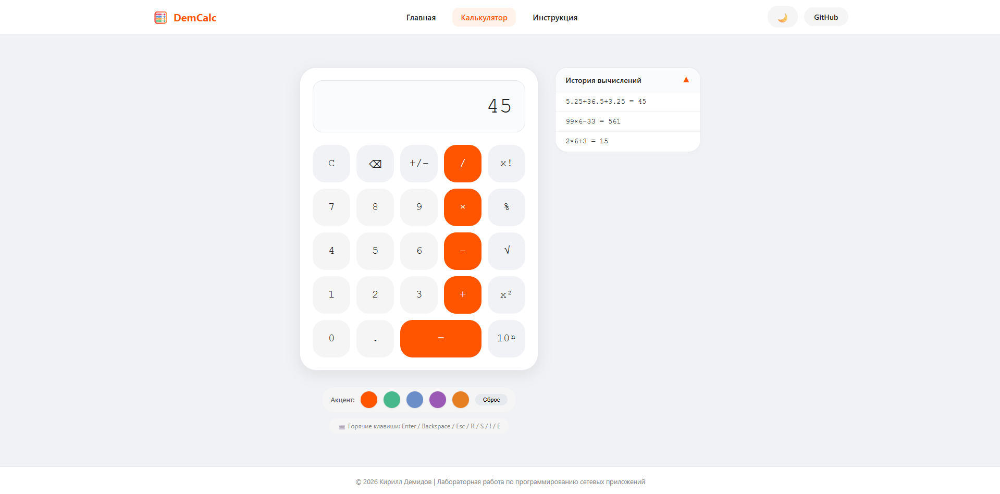

# Лабораторная работа №2: Calculator. JavaScript

## Цель работы
Знакомство с инструментами построения пользовательских интерфейсов web-сайтов: **HTML**, **CSS**, **JavaScript**. В ходе выполнения работы предстояло продолжить реализацию простого калькулятора с расширенным функционалом и современным дизайном.

---

## План работы
HTML/CSS разметка → JavaScript логика → Доступ к HTML-элементам →
Программирование кнопок → Запуск через LiveServer → Выполнение заданий

### Этапы разработки:
- **HTML/CSS разметка** — базовая структура калькулятора
- **JavaScript логика** — программирование математических операций
- **Доступ к HTML-элементам** — связывание скрипта с интерфейсом
- **Программирование кнопок** — обработка событий
- **Запуск через LiveServer** — тестирование в реальном времени

---

## Реализованные функции

| Функция | Описание |
|---------|----------|
| **Смена знака** | Операция смены знака числа (+/-) |
| **Вычисление процента** | Операция вычисления процента (%) |
| **Backspace** | Кнопка стирания последней введенной цифры |
| **Ввод с клавиатуры** | Поддержка ввода чисел и операций с клавиатуры |
| **Квадратный корень** | Вычисление квадратного корня (√) |
| **Возведение в квадрат** | Операция возведения числа в квадрат |
| **Факториал** | Вычисление факториала числа (x!) |
| **10ⁿ** | Операция умножения на 10 в степени вводимого числа |
| **История вычислений** | Просмотр предыдущих операций и результатов |

---

## Нововведения (дизайн + функционал)

### Дизайн, вдохновленный Яндекс Маркетом
- Минималистичный и современный интерфейс
- Чистая типографика и удобное расположение элементов

### Кнопка ссылки на Яндекс Маркет
- Быстрый переход на главную страницу Маркета
- Интеграция с экосистемой Яндекса

### Изменение темы на всех страницах
- Переключение между светлой и темной темой
- Единый стиль для всего приложения
- Сохранение выбранной темы

```javascript
const themeToggle = document.getElementById('themeToggle');
if (themeToggle) {
    const savedTheme = localStorage.getItem('calculatorTheme');
    if (savedTheme === 'dark') {
        document.body.classList.add('dark-theme');
        themeToggle.textContent = '☀️';
    }

    themeToggle.onclick = function() {
        if (document.body.classList.contains('dark-theme')) {
            document.body.classList.remove('dark-theme');
            themeToggle.textContent = '🌙';
            localStorage.setItem('calculatorTheme', 'light');
        } else {
            document.body.classList.add('dark-theme');
            themeToggle.textContent = '☀️';
            localStorage.setItem('calculatorTheme', 'dark');
        }
    };
}
```

### История вычислений
- Отображение всех выполненных операций
- Возможность просмотра предыдущих вычислений
- Чистый и понятный интерфейс истории

```javascript
let historyList = [];
const historyContainer = document.getElementById('historyList');

function addToHistory(expression, result) {
    historyList.unshift({ 
        expression, 
        result, 
        timestamp: new Date().toLocaleTimeString() 
    });
    if (historyList.length > 20) historyList.pop(); // Ограничиваем 20 записями
    updateHistoryDisplay();
}

function updateHistoryDisplay() {
    if (!historyContainer) return;
    if (historyList.length === 0) {
        historyContainer.innerHTML = '<div class="history-empty">Пока нет истории</div>';
        return;
    }
    historyContainer.innerHTML = historyList.map(item =>
        `<div class="history-item">${item.expression} = ${item.result}</div>`
    ).join('');

    // Поддержка свёрнутого режима (показываем только последнюю операцию)
    const isCollapsed = historyContainer.classList.contains('collapsed');
    if (isCollapsed && historyList.length > 0) {
        const allItems = historyContainer.querySelectorAll('.history-item');
        allItems.forEach((item, index) => {
            if (index !== 0) item.style.display = 'none';
            else item.style.display = 'block';
        });
    }
}
```

### Изменение цвета кнопок калькулятора
- Динамическая смена цветовой схемы кнопок
- Визуальная обратная связь при нажатии
- Настройка внешнего вида под предпочтения пользователя

```javascript
const colorOptions = document.querySelectorAll('.color-option');
const resetColorBtn = document.getElementById('resetColorBtn');

function applyButtonColor(color) {
    document.querySelectorAll('.my-btn.primary').forEach(btn => {
        btn.style.backgroundColor = color;
    });
    localStorage.setItem('buttonColor', color);
}

if (colorOptions.length) {
    const savedColor = localStorage.getItem('buttonColor');
    if (savedColor) applyButtonColor(savedColor);
    
    colorOptions.forEach(option => {
        option.onclick = () => applyButtonColor(option.getAttribute('data-color'));
    });
    
    if (resetColorBtn) {
        resetColorBtn.onclick = () => {
            document.querySelectorAll('.my-btn.primary').forEach(btn => {
                btn.style.backgroundColor = '';
            });
            localStorage.removeItem('buttonColor');
        };
    }
}
```

## Особенности реализации

- Интерактивный калькулятор с расширенным функционалом
- Поддержка как кликов мышкой, так и ввода с клавиатуры
- Интерфейс с обратной связью при нажатии
- Обработка граничных случаев (деление на ноль, отрицательные факториалы и др.)
- **Адаптивный дизайн** — корректное отображение на разных устройствах
- **Локальное хранилище** — сохранение настроек темы

---

## Скриншоты выполненного задания


Страница "Главное", открывается при запуске приложения


Страница "Инструкция", где описаны все функции и правила использования приложения


Старница "Калькулятор", где и находится дизайн основной части приложения


Тёмная версия страницуы "Калькулятор"


Демонстрация ввода значений калькулятора 


Демонстрация результатов вычислений и открытую историю вычислений


### Унарные операции (√, x², x!, %)
```javascript
function applyUnaryOperation(operation, symbol) {
    if (currentExpression === '') return;
    
    // Находим последнее число в выражении
    const match = currentExpression.match(/[\d\.]+(?!.*[\d\.])/);
    if (!match) return;
    
    const lastNumber = match[0];
    const lastNumberIndex = currentExpression.lastIndexOf(lastNumber);
    let num = parseFloat(lastNumber);
    let result;
    let newNumberStr;
    
    switch(operation) {
        case 'sqrt':
            if (num < 0) {
                outputElement.innerHTML = 'Ошибка';
                return;
            }
            result = Math.sqrt(num);
            newNumberStr = formatDisplay(result);
            break;
        case 'square':
            result = num * num;
            newNumberStr = formatDisplay(result);
            break;
        case 'factorial':
            if (num < 0 || !Number.isInteger(num)) {
                outputElement.innerHTML = 'Ошибка';
                return;
            }
            let fact = 1;
            for (let i = 2; i <= num; i++) fact *= i;
            result = fact;
            newNumberStr = formatDisplay(result);
            break;
        case 'percent':
            result = num / 100;
            newNumberStr = formatDisplay(result);
            break;
        default:
            return;
    }
    
    // Заменяем последнее число в выражении на результат
    const before = currentExpression.substring(0, lastNumberIndex);
    const after = currentExpression.substring(lastNumberIndex + lastNumber.length);
    currentExpression = before + newNumberStr + after;
    waitingForOperand = false;
    updateDisplay();
}

// Назначение обработчиков
document.getElementById("btn_op_sqrt").onclick = () => applyUnaryOperation('sqrt', '√');
document.getElementById("btn_op_deg").onclick = () => applyUnaryOperation('square', 'x²');
document.getElementById("btn_op_fuck").onclick = () => applyUnaryOperation('factorial', 'x!');
document.getElementById("btn_op_percent").onclick = () => applyUnaryOperation('percent', '%');
```

### Смена знака у последнего числа
```javascript
function toggleSign() {
    if (currentExpression === '') return;
    
    // Находим последнее число в выражении
    const match = currentExpression.match(/-?[\d\.]+(?!.*[+\-×/])/);
    if (!match) return;
    
    const lastNumber = match[0];
    const lastNumberIndex = currentExpression.lastIndexOf(lastNumber);
    let newNumber;
    
    if (lastNumber.startsWith('-')) {
        newNumber = lastNumber.substring(1);
    } else {
        newNumber = '-' + lastNumber;
    }
    
    const before = currentExpression.substring(0, lastNumberIndex);
    const after = currentExpression.substring(lastNumberIndex + lastNumber.length);
    currentExpression = before + newNumber + after;
    updateDisplay();
}

document.getElementById("btn_op_sign").onclick = toggleSign;
```

---

## Автор

**Студент:** Демидов Кирилл Андреевич  
**Группа:** ИУ5-43б  
**Год:** 2026

---

<div align="center">
  Лабораторная работа выполнена в рамках курса "Программирование сетевых приложений"
</div>
